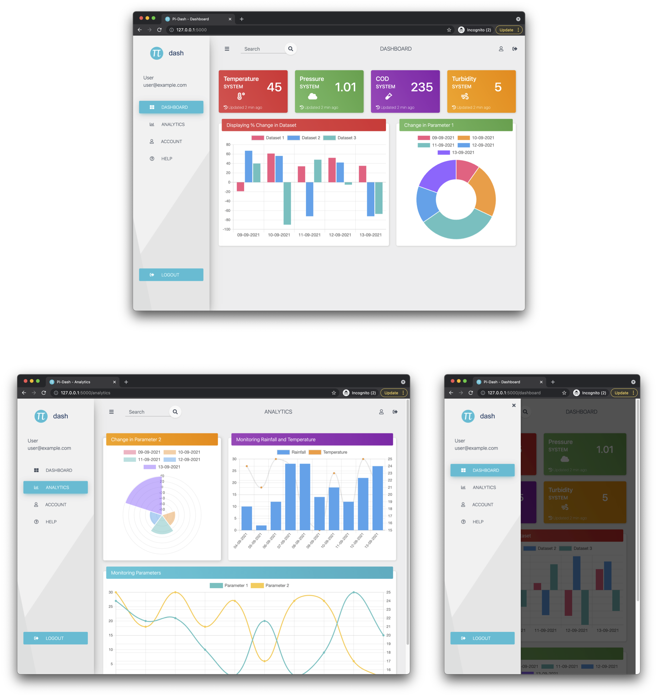

# Flask Dashboard

flask-dashboard is a web-application built using python flask to display data as charts on a dashboard.



It uses ***flask app.route*** to route the url to its appropriate backend function. The html file is served using ***render_template*** function which uses jinja2 template. The html templates are rendered using ***jinja2 templating engine***, where the common structures of the plots are replicated using ***macros***.

The ***frontend*** uses ***bootstrap4*** for a responsive design and styling.

## Quick start

### Setup environment variable

This application uses only a secret key.

```shell
export SECRET_KEY="your-unique-secret-key-secret-only-to-you"
```

### Run

```shell
python app.py
```

## Roadmap

- [ ] Implment chartjs using a fetch call from the backend for passing data.
- [ ] Add a use case for the dashboard, using any open APIs available to fetch data.
- [ ] Add deployment documentation to Heroku or AWS.